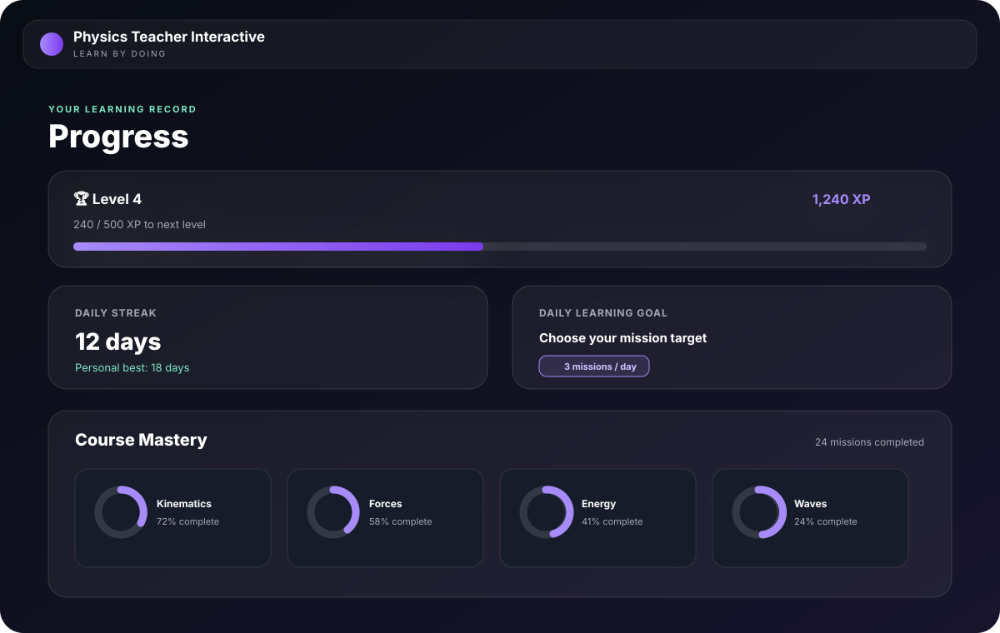
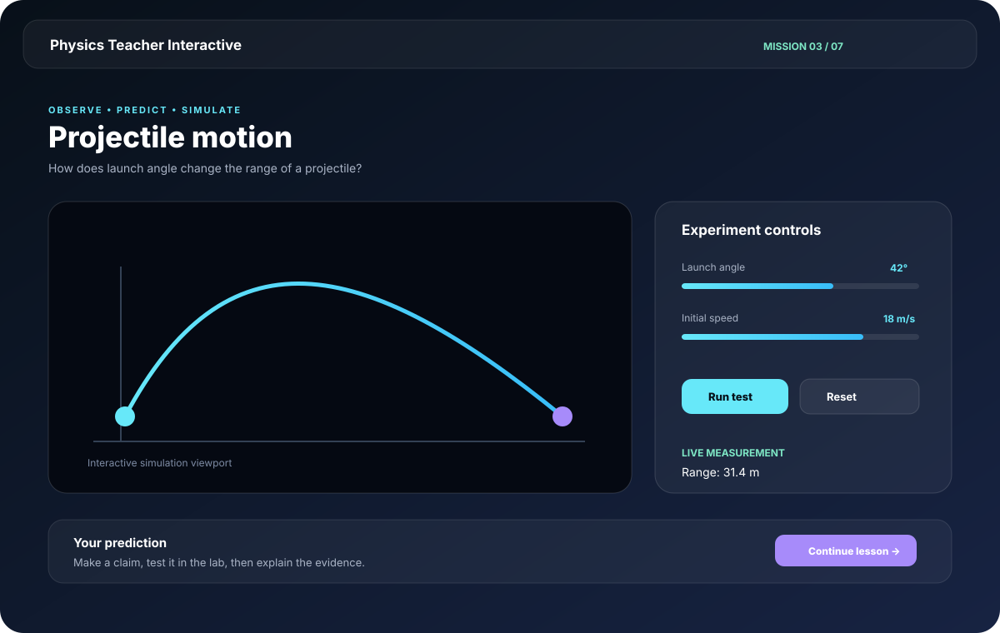

# Physics Teacher Interactive

Physics Teacher Interactive is an interactive physics teacher inspired by **Brilliant** and **Duolingo**—but built for physics.

It teaches through short, guided lessons instead of long textbook chapters. You make predictions, run simulations, work through examples, and explain what happened. When a lesson needs algebra, vectors, trigonometry, or another prerequisite, the app teaches that background math as part of the lesson.

The goal is to make physics feel like a skill you practice every day: curious, visual, and hands-on.

## App Preview

The interface uses a responsive, liquid-glass-inspired visual system with a focused mission player and a progress dashboard for long-term mastery.





Run the app locally with `npm run dev` to explore the live simulations and responsive layouts.

## What you can do

- Follow a complete Physics Foundations course from measurement and vectors through mechanics and oscillations.
- Explore starter paths covering topics such as waves, thermodynamics, electromagnetism, optics, relativity, quantum physics, and astrophysics.
- Learn with bite-sized missions built around **Observe → Predict → Simulate → Explain → Check**.
- Open the math behind an equation in two ways: a quick explanation or a step-by-step foundation lesson.
- Change values in interactive experiments and see the physics respond immediately.
- Track XP, streaks, daily goals, course mastery, and checkpoint badges locally or sync them securely across devices with an optional account.
- Use light, night, eye-comfort, ocean, high-contrast, custom-color, and optional Liquid Glass themes.

Every simulation is designed to remain useful on mobile devices. If a device cannot run WebGL, the app keeps the controls, explanations, graphs, and measurements available in a reduced visual mode.

The app is free and open source. An account is optional: anonymous learners keep their progress in the browser and can export a backup, while signed-in learners sync the same progress through Supabase.

## Run Locally

Requires Node.js 22.20 or newer:

```sh
npm ci
npm run dev
```

Run comprehensive quality checks:

```sh
npm run check          # Typecheck, lint, unit tests, and Vite production build
npm run test:e2e        # Playwright end-to-end browser journeys
```

Cloud accounts require a Supabase project. Copy `.env.example` to `.env.local`, add the project URL and public publishable key, then run the SQL migration in `supabase/migrations`. The [deployment guide](docs/DEPLOYMENT.md) covers GitHub Pages and Vercel setup. Never expose a Supabase secret or service-role key in this frontend.

## Project Guides

- [Architecture](docs/ARCHITECTURE.md) — System components, boundaries, state machine, and data flow
- [Curriculum](docs/CURRICULUM.md) — Complete 14-course syllabus, starter paths, and math roadmap
- [Authoring Guide](docs/AUTHORING.md) — Authoring courses, missions, layered math, and physics models
- [Scientific Validation](docs/SCIENTIFIC_VALIDATION.md) — Dimensional consistency, reference cases, and model limits
- [Sources and Citations](docs/SOURCES.md) — Open educational citations, reference maps, and boundary limits
- [Deployment](docs/DEPLOYMENT.md) — GitHub Pages static deployment and subpath verification
- [Contributing](CONTRIBUTING.md) — Development guidelines and contribution policies

## License and Source Policy

Project licensing is recorded in the repository license. Source citations support scientific claims and contextual study; course explanations, numerical problems, interactive simulations, and learning assets are original works.
